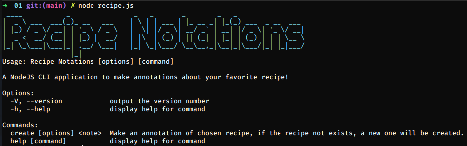

# Day 01 - Recipe Notations

The first day's project is a **Recipe Notations using CLI**. With this, you will be able to make one or more annotations about your favorite recipe or recipes using a simple and pratice command line. Enjoy! 

## How to run
1. Install the commander dependencies using `npm install` or `yarn install`
2. Run `node recipe.js` to see the project presentation and the available flags to use to make your annotations